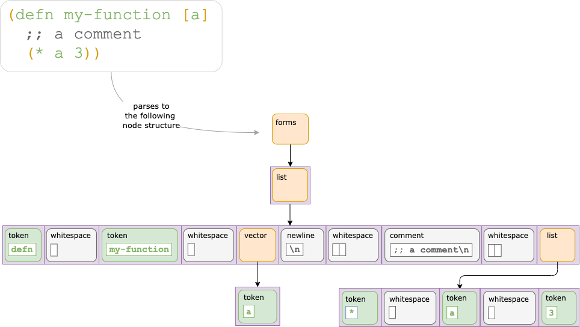

= Introduction
// TODO update these to real values
:cljdoc-host: https://cljdoc.org
:cljdoc-api-url: {cljdoc-host}/d/lread/rewrite-cljc-playground/CURRENT/api
:toclevels: 5
:toc:

== Introduction
The rewrite-cljc library reads and writes Clojure, ClojureScript and https://github.com/edn-format/edn[EDN] source code while preserving whitespace and comments.

== Interesting Alternatives
If rewrite-cljc is not your cup of tea, consider following alternatives:

|===
| Project | Parsing? | Writing? | Whitespace Perserving? | Includes Element Row/Col?

| https://github.com/carocad/parcera[parcera]
| yes
| yes
| yes
| yes

| https://github.com/borkdude/edamame[edamame]
| yes
| no
| no
| yes

|===

== History
@xsc created https://github.com/xsc/rewrite-clj[rewrite-clj] in 2013.
Its original use was to upgrade dependencies in https://leiningen.org[lein] project.clj files.
The library quickly took off in popularity and is the default choice for modifying Clojure/EDN from Clojure.

@rundis created rewrite-cljs in 2015 to match the features of rewrite-clj for ClojureScript developers.
It was originally used for refactoring support in https://github.com/LightTable/LightTable[Light Table].
In January of 2019, @rundis graciously https://github.com/clj-commons/rewrite-cljs[transferred rewrite-cljs to clj-commons].

Seeing an opportunity to give back to the Clojure community, in 2019 @lread, with guidance and help from many friendly Clojurians, started work on rewrite-cljc.
The goal is to provide a thoughtfully maintained feature-complete library that can be used from either Clojure or ClojureScript.
While the merging rewrite-clj and rewrite-cljs to create rewrite-cljc was not trivial, the real hard work was done over many years in rewrite-clj and rewrite-cljs under the leadership of @xsc and @rundis (thanks guys!).
Read link:design/01-merging-rewrite-clj-and-rewrite-cljs.adoc[Merging rewrite-clj and rewrite-cljs] for details on the rewrite-cljc merge.

== Upgrading from rewrite-clj and/or rewrite-cljs
Both rewrite-clj and rewrite-cljs have a root namespace of `rewrite-clj`.
The rewrite-cljc library has a root namespace of `rewrite-cljc`.

To upgrade to rewrite-cljc, update your project dependencies, and rename your `ns` `:requires` from `rewrite-clj` to `rewrite-cljc` in your source files.

Need to know more? link:design/01-merging-rewrite-clj-and-rewrite-cljs.adoc#_changes[Details of changes].

== Intro to Rewrite-cljc Nodes

Rewrite-cljc parses Clojure source into rewrite-cljc nodes.

While reviewing the following example, it helps to remember that Clojure source is simply data.

You can work with these link:#parser-api[nodes directly] or take advantage of the power of the link:#zip-api[zip API].

Rewrite-cljc offers easy conversion from rewrite-cljc nodes to Clojure forms and back.
This is usually very convenient but does come with some caveats.
As you get more experienced with rewrite-cljc, you will want to review link:#sexpr-nuances[sexpr nuances].

== Rewrite-cljc APIs
With the exception of the different root namespace of `rewrite-cljc`, rewrite-cljc is intended to be a mostly API compatible replacement for rewrite-clj and/or rewrite-cljs.
There are 4 public API namespaces:

. `rewrite-cljc.zip`
. `rewrite-cljc.parser`
. `rewrite-cljc.node`
. `rewrite-cljc.paredit`

[#zip-api]
=== Zip API
Traverse and modify Clojure/ClojureScript/EDN.
This is considered the main rewrite-cljc API and might very well be all you need.

==== A Brief Introduction to Zippers

[TIP]
====
Rewrite-cljc uses a customized version of
https://clojure.github.io/clojure/clojure.zip-api.html[Clojure's clojure.zip].
If you are not familiar with zippers, you may find the following resources helpful:

* https://clojure.org/reference/other_libraries#_zippers_functional_tree_editing_clojure_zip[Clojure overview of zippers]
* https://lambdaisland.com/blog/2018-11-26-art-tree-shaping-clojure-zip[Arne Brasseur - The Art of Tree Shaping with Clojure Zippers]
* https://tbaldridge.pivotshare.com/media/zippers-episode-1/11348/feature?t=0[Tim Baldrige - PivotShare - Series of 7 Videos on Clojure Zippers]
====

A rewrite-cljc zipper holds:

* a tree of rewrite-cljc nodes representing your parsed Clojure source
* your current location within the zipper

Because the zipper holds both the tree and your location within the tree, its variable is commonly named `zloc`.
The zipper is immutable, as such, location changes and node modifications are always returned in a new zipper.

.REPL session
[source, clojure-repl]
----
user=> (require '[rewrite-cljc.zip :as z])
nil

user=> (def data-string
"(defn my-function [a]
  ;; a comment
  (* a 3))")
#'user/data-string

user=> (def zloc (z/of-string data-string))  ;; <1>
#'user/zloc

user=> (z/sexpr zloc)  ;; <2>
(defn my-function [a] (* a 3))
user=> (-> zloc z/down z/right z/node)
<token: my-function>
user=> (-> zloc z/down z/right z/sexpr)
my-function

user=> (-> zloc
           z/down
           z/right
           (z/edit (comp symbol str) "2")
           z/up
           z/sexpr) ;; <3>
(defn my-function2 [a] (* a 3)) fs

user=> (-> zloc
           z/down
           z/right
           (z/edit (comp symbol str) "2")
           z/print-root) ;; <4>
(defn my-function2 [a]
  ;; a comment
  (* a 3))nil
----
<1> use `of-string` to parse nodes and create zipper in one step

<2> explore what we've parsed via our zipper

<3> rename my-function to my-function2 and return resulting s-expression.
`rewrite-cljc.zip/edit` and `rewrite-cljc.zip/replace` transparently coerce between the node representation (`<token: my-function>`) and its corresponding s-expression (`my-function`).

<4> rename my-function to my-function2 and print from root node. Original whitespace is preserved.

TIP: The zip location movement functions (`right`, `left`, `up`, `down`, etc) skip over whitespace nodes.
If you want to see all nodes, use the `+*+` counterparts (`right*`, `left*`, `up*`, `down*`, etc).

See link:{cljdoc-api-url}/rewrite-cljc.zip[zip API docs].

==== Finding Elements with the Zip API

The `rewrite-cljc.zip` namespace includes find operations to navigate to locations of interest in your zipper.
Let's assume you want to modify the following minimal `project.clj` by replacing the `:description` placeholder text with something more meaningful:

.project.clj snippet
[source, clojure]
----
(defproject my-project "0.1.0-SNAPSHOT"
  :description "Enter description")
----

Most find functions accept an optional location movement function.
Use:

* `rewrite-cljc.zip/right` (the default) - to search sibling nodes to the right
* `rewrite-cljc.zip/left` to search siblings to left
* `rewrite-cljc.zip/next` for a depth-first tree search

.REPL session
[source, clojure-repl]
----
user=> (require '[rewrite-cljc.zip :as z])
nil

user=> (def zloc (z/of-file "project.clj")) ;; <1>
#'user/zloc

user=> (def zloc-prj-map (z/find-value zloc z/next 'defproject)) ;; <2>
#'user/zloc-prj-map

user=> (def zloc-desc (-> zloc-prj-map (z/find-value :description) z/right)) ;; <3>
#'user/zloc-descr

user=> (z/sexpr zloc-desc)
"Enter description"

user=> (-> zloc-desc (z/replace "My first Project.") z/print-root) ;; <4>
(defproject my-project "0.1.0-SNAPSHOT"
  :description "My first Project.")
nil

----
<1> parse the `project.clj` into a zipper.footnote:file[reading from a file is only available from Clojure.]

<2> navigate depth-first to the project map by searching for `'defproject`.

<3> navigate to the description text by searching right for `:description` and then moving one node to the right.
Remember that while whitespace is preserved, it is automatically skipped during navigation.

<4> replace the description, zip up and print the result.

==== Familiar Functions for Updating Nodes with the Zip API

The zip API provides familiar ways to work with parsed Clojure data structures.
It offers functions that correspond to the standard seq functions, for example:

.REPL session
[source, clojure-repl]
----
user=> (require '[rewrite-cljc.zip :as z])
nil

user=> (def zloc (z/of-string "[1\n2\n3]"))
#'user/zloc

user=> (z/vector? zloc)
true

user=> (z/sexpr zloc)
[1 2 3]

user=> (-> zloc (z/get 1) z/node)
<token: 2>

user=> (-> zloc (z/assoc 1 5) z/sexpr)
[1 5 3]

user=> (->> zloc (z/map #(z/edit % + 4)) z/->root-string)
"[5\n6\n7]"
----

==== Tracking Position with the Zip API

If you need to track the source row and column while reading and manipulating your zipper, create your zipper with `:track-position true` option.
Note that the row and column are 1-based.

.REPL session
[source,clojure-repl]
----
user=> (require '[rewrite-cljc.zip :as z])
nil

user=> (def zloc (z/of-string
                  "(defn sum-me\n  \"Add 'em up!\"\n  [a b c]\n  (+ a\n     c))"
                  {:track-position? true})) ;; <1>
#'user/zloc

user=> (println (z/root-string zloc)) ;; <2>
(defn sum-me
  "Add 'em up!"
  [a b c]
  (+ a
     c))
nil

user=> (def zc (-> zloc
                   (z/find-value z/next '+)
                   (z/find-value z/next 'c))) ;; <3>
#'user/zc

user=> (z/string zc) ;; <4>
"c"

user=> (z/position zc) ;; <5>
[5 6]

user=> (def zc2 (-> zc
                   (z/insert-left 'b)
                   (z/insert-newline-left)
                   (z/insert-space-left 5))) ;; <6>
#'user/zc2

user=> (z/string zc2)
"c"

user=> (println (z/root-string zc2)) ;; <7>
(defn sum-me
  "Add 'em up!"
  [a b c]
  (+ a
     b
     c))
nil

user=> (z/position zc2) ;; <8>
[6 6]
----

<1> parse some Clojure source into a position tracking zipper

<2> print zipper to get a formatted view

<3> navigate to 2nd `c` in zipper

<4> verify we are where we think we are in the zipper

<5> examine position of c. It is on the 5th row and 6th column.

<6> insert new element b with indentation and alignment.

<7> verify we are where we think we are in the zipper

<8> examine our zipper with the new element b

<9> examine updated position of c. It is on the 6th row and 6th column.

[#parser-api]
=== Parser API
Parses Clojure/ClojureScript/EDN to rewrite-cljc nodes.
The zip API makes use of the Parser API to parse Clojure into zippers.
If your focus is parsing instead of rewriting, you might find this lower level API useful.
You can choose to parse one or all https://www.braveclojure.com/do-things/#Forms[forms] from a string or a file.footnote:file[]

The parser API takes advantage of https://github.com/clojure/tools.reader[clojure.tools.reader] for simple forms.

Here we parse a single form from a string:

.REPL session
[source, clojure-repl]
----
user=> (require '[rewrite-cljc.parser :as p])
nil

user=> (def form-nodes (p/parse-string "(defn my-function [a]\n  (* a 3))"))
#'user/form-nodes

user=> form-nodes
<list:
  (defn my-function [a]
    (* a 3))
>
----

See link:{cljdoc-api-url}/rewrite-cljc.parser[parser API docs].

=== Node API
Inspect, analyze and create rewrite-cljc nodes.

Continueing from the form we parsed above:

.REPL session continued
[source, clojure-repl]
----
user=> (require '[rewrite-cljc.node :as n])
nil

user=> (n/tag form) ;; <1>
:list

user=> (n/children form)
(<token: defn> <whitespace: " "> <token: my-function> <whitespace: " "> <vector: [a]> <newline: "\n"> <whitespace: "  "> <list: (* a 3)>)

user=> (n/sexpr form)
(defn my-function [a] (* a 3))

user=> (n/child-sexprs form)
(defn my-function [a] (* a 3))

user=> (n/string form) ;; <2>
"(defn my-function [a]\n  (* a 3))"

user=> (n/coerce '[a b c]) ;; <3>
<vector: [a b c]>

user=> (n/meta-node  ;; <4>
  (n/token-node :private)
  (n/token-node 'sym))
<meta: ^:private sym>
----
<1> explore what we've parsed
<2> convert the parsed nodes back to a printable string
<3> create a node from nearly any value using `coerce`
<4> nodes can also be created by hand

See link:{cljdoc-api-url}/rewrite-cljc.node[node API docs].

=== Paredit API
Structured editing was introduce by rewrite-cljs and carried over to rewrite-cljc.

See link:{cljdoc-api-url}/rewrite-cljc.paredit[current paredit API docs].

[#sexpr-nuances]
== Sexpr Nuances

Rewrite-cljc parses arbitrary Clojure/ClojureScript source code into rewrite-cljc nodes.
Converting rewrite-cljc nodes to Clojure forms via `sexpr` is convenient, but it does come with some caveats.

=== Whitespace
The whitespace that a rewrite-cljc node so carefully preserves is lost when converting to a Clojure form.

[source, clojure-repl]
----
Clojure 1.10.1
user=> (require '[rewrite-cljc.parser :as p] '[rewrite-cljc.node :as n])
nil
user=> (def n (p/parse-string "{  :a 1\n\n   :b 2}"))
#'user/n
user=> n  ;; <1>
<map:
  {  :a 1

     :b 2}
>
nil
user=> (n/children n) ;; <2>
(<whitespace: "  "> <token: :a> <whitespace: " "> <token: 1> <newline: "\n\n"> <whitespace: "   "> <token: :b> <whitespace: " "> <token: 2>)
user=> (n/sexpr n) ;; <3>
{:b 2, :a 1}
----
<1> Rewrite-cljc prints out nodes in a debug friendly format, here we see whitespace is preserved
<2> If we look at the map node's child nodes, we clearly see the whitespace nodes
<3> When we convert to the map node to an sexpr we get the Clojure form. This does not include the specifics of the original whitespace.

=== Not all Source is Sexpr-able

Some source code elements are not sexpr-able.
Reader ignore/discard `#_`, comment and whitespace all throw an "unsupported operation" exception.

[source, clojure]
----
(require '[rewrite-cljc.zip :as z])

(-> (z/of-string "#_42") z/sexpr) ;;
(-> (z/of-string ";; can’t sexpr me!") z/next* z/sexpr) ;; <1>
(-> (z/of-string " ") z/next* z/sexpr) ;; <1>
----
<1> Notice the use of `next*` to include normally skipped nodes.

=== Differences in Clojure Platforms

Clojure and ClojureScript have differences, some examples you might run into when using `sexpr` are:

[source, clojure]
----
(require '[rewrite-cljc.zip :as z])

(-> (z/of-string "3/4") z/sexpr) ;; <1>
;; clj => 3/4
;; cljs => 0.75
(+ 10 (z/of-string "9007199254740991") z/sexpr) ;; <2>
;; clj => 9007199254741001
;; cljs => 9007199254741000
(-> (z/of-string "\\a") z/sexpr) ;; <3>
;; clj => \a
;; cljs => "a"

----
<1> Clojure returns Ratio `3/4`, +
ClojureScript has no Ratio and returns `0.75`
<2> Clojure and ClojureScript inherit integral types and behavior from their host platforms. +
<3> Clojure has a character type but ClojureScript does not and represents characters as strings

Note that these differences affect `sexpr` only.
Rewrite-cljc should be able to parse and rewrite all valid Clojure/ClojureScript code.

=== Namespaced Elements

[auto-resolve-support]
==== Auto-resolve Support
In Clojure keywords can be qualified:

* `:my-qualifier/kw`
* `#:my-qualifer{:kw 1}`.

Qualification can also come from auto-resolving:

* to the current namespace:
** `::kw`
** `#::{:kw 1}`
* or the namespace of an alias:
** `::my-alias/kw`
** `#::my-alias{:kw 1}`

When calling `sepxr` on auto-resolved keyword or map node, rewrite-cljc will resolve:

* the current ns to `user`
* namespace alias `x` to `x-unresolved`

[source, clojure-repl]
----
user=> (require '[rewrite-cljc.parser :as p]
                '[rewrite-cljc.node :as n])
nil
user=> (-> (p/parse-string "::kw") n/sexpr)
:user/kw
user=> (-> (p/parse-string "#::{:a 1 :b 2}") n/sexpr)
:user{:a 1, :b 2}
user=> (-> (p/parse-string "::my-alias/kw") n/sexpr)
:my-alias-unresolved/kw
user=> (-> (p/parse-string "#::my-alias{:a 1 :b 2}") n/sexpr)
:my-alias-unresolved{:a 1, :b 2}
----

This default behavior should be sufficient for most use cases (let us know if we are wrong about that).
If you'd prefer a different behavior, specify a function for `:auto-resolve` in the optional `opts` arg of:

* The rewrite-cljc.node namespace functions `sexpr` and `child-sexpr`.
* The rewrite-cljc.zip namespace zipper creation functions `edn*`, `edn`, `of-string` and `of-file`.
The resulting zipper will then automatically apply your auto-resolve within any zip operation that makes use of sexpr. These are:
** `sexpr`
** `find-value` and `find-next-value` - sexpr is applied to each node to get the "value" for comparison
** `edit` - the current node is sexpr-ed
** `get` and `assoc` - sexpr is applied to the map key

The `:auto-resolve` function takes a single arg `alias` for lookup and must return symbol.
The `alias` will be:

* `:current` for a request for the current namespace
* otherwise it will be a symbol for the namespace alias to lookup

For example, if you know the current namespace and the namespace aliases it loads, you can specify them:
[source, clojure-repl]
----
user=> (require '[rewrite-cljc.parser :as p]
                '[rewrite-cljc.node :as n])
nil
user=> (defn resolver [alias]
         (or (get {:current 'my.current.ns
                   'my-alias 'my.aliased.ns} alias)
             (symbol (str alias "-unresolved"))))
#'user/resolver
user=> (-> (p/parse-string "::kw") (n/sexpr {:auto-resolve resolver}))
:my.current.ns/kw
user=> (-> (p/parse-string "#::{:a 1 :b 2}") (n/sexpr {:auto-resolve resolver}))
#:my.current.ns{:a 1, :b 2}
user=> (-> (p/parse-string "::my-alias/kw") (n/sexpr {:auto-resolve resolver}))
:my.aliased.ns/kw
user=> (-> (p/parse-string "#::my-alias{:a 1 :b 2}") (n/sexpr {:auto-resolve resolver}))
#:my.aliased.ns{:a 1, :b 2}
----

== Dealing with Reader Generated Metadata
TODO: maybe hardcode? Either that or move from dynamic var to passed opt.

Rewrite-cljc offers, where it can, transparent coercion from Clojure forms to rewrite-cljc nodes.

Clojure will, in some cases, add location metadata that is not in the original source code, as illustrated here:

.REPL session
[source,clojure-repl]
----
Clojure 1.10.1
user=> ;; a quoted list has :line and :column metadata
user=> (meta '(1 2 3))
{:line 1, :column 8}
----

Rewrite-cljc will, on coercion from Clojure forms to rewrite-cljc nodes, omit location metadata.
No rewrite-cljc metadata node will will be created if resulting metadata is empty.

On conversion from rewrite-cljc nodes to Clojure forms via `sexpr`, I don't see a way to omit the location metadata.
With the assumption that you will generally coerce Clojure forms back to rewrite-cljc nodes, this should not cause an issue.

You can use `rewrite-cljc.node/form-meta` in place of `clojure.core/meta` if you'd like to only see metadata that was actually in original Clojure source code.

To support those using rewrite-cljc under sci, in addition to `:line` and `:column` rewrite-cljc also removes `:end-line` and `:end-column` metadata.
Note that while Clojure only adds location metadata to quoted lists, sci adds it to all forms that accept metadata.

Omitting location metadata is a deviation from rewrite-clj behavior.
Should you wish, for whatever reason, to preserve rewrite-clj behavior and not remove location metadata, bind `rewrite-cljc.node/\*elide-metadata*` to `nil`.
